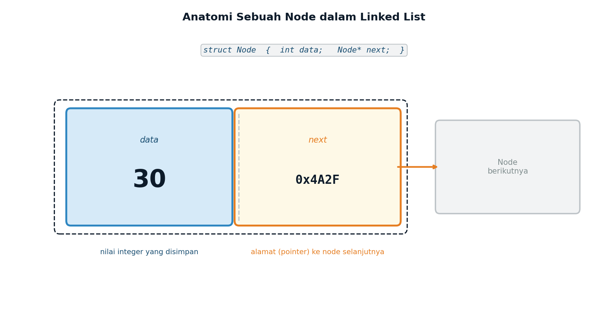
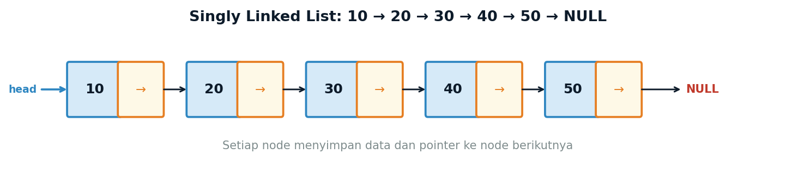
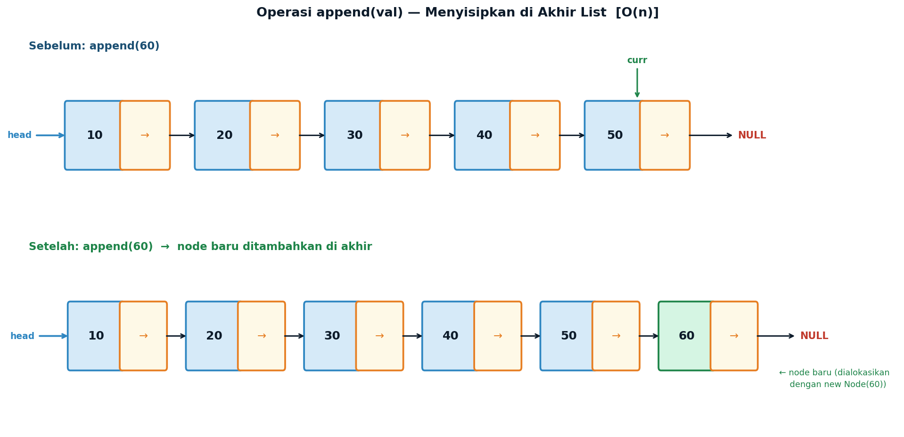
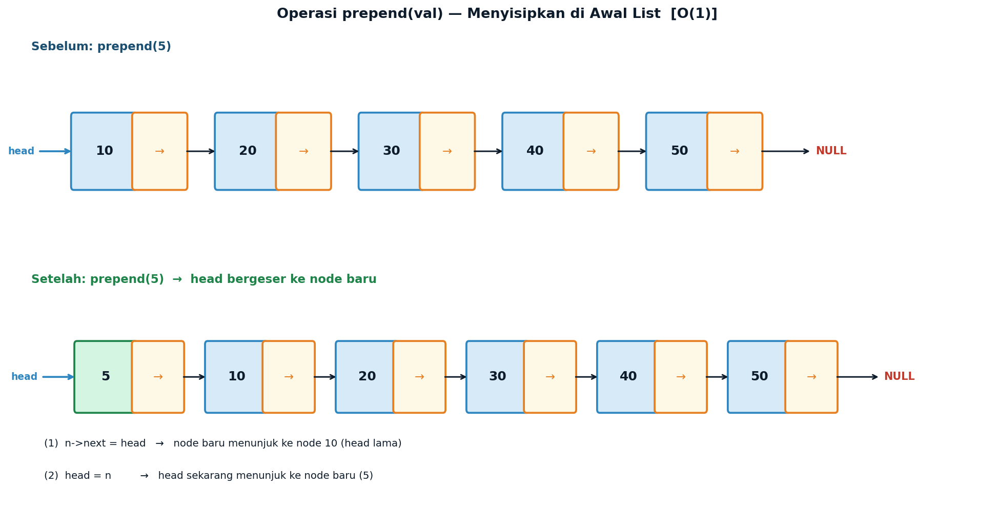
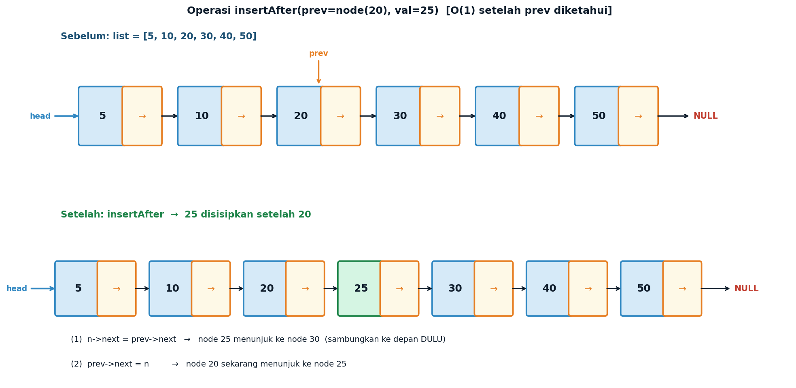
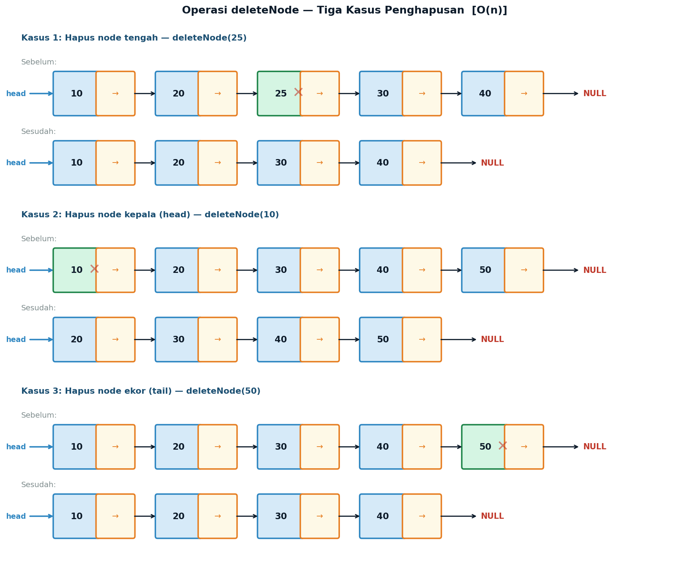
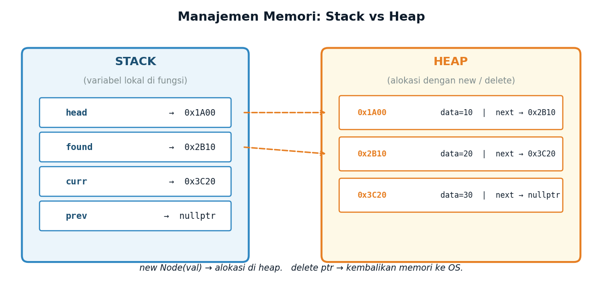
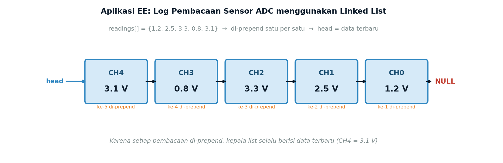

# Lecture 9 — Linked List
## *Dynamic Pointer-Based Data Structures in C++*

**ENEE602004 · Algoritma Pemrograman dan Praktikum**
Dr. Alfan Presekal · Electrical Engineering · Universitas Indonesia

<div style="page-break-after: always;"></div>

---

# Topik yang Dibahas

- Keterbatasan array dan mengapa Linked List dibutuhkan
- Definisi `struct Node` dan cara kerja pointer
- Empat operasi utama: `prepend`, `append`, `insertAfter`, `deleteNode`
- Manajemen memori: Stack vs Heap, `new` dan `delete`
- Perbandingan Array vs Linked List
- Aplikasi EE: Buffer log sensor ADC

### File Demo

| File | Topik |
|------|-------|
| `src/01_append_prepend.cpp` | Membangun list: append dan prepend |
| `src/02_search.cpp` | Pencarian nilai dalam list |
| `src/03_insert_delete.cpp` | insertAfter dan deleteNode |
| `src/04_ee_sensor.cpp` | Aplikasi: log sensor ADC |

<div style="page-break-after: always;"></div>

---

# Slide 1 — Mengapa Array Tidak Cukup?

Array memiliki keterbatasan fundamental untuk operasi insert dan delete.

```cpp
// Insert nilai 30 di posisi indeks 2 — O(n)
int arr[6] = {10, 20, 40, 50, 0, 0};
int n = 4, pos = 2, val = 30;
for (int i = n; i > pos; i--)
    arr[i] = arr[i-1];   // geser semua elemen → O(n)!
arr[pos] = val;
n++;
// Hasil: {10, 20, 30, 40, 50}
```

| Masalah Array | Dampak |
|---------------|--------|
| Insert di tengah | O(n) — semua elemen setelah posisi harus digeser |
| Hapus elemen | O(n) — semua elemen setelah posisi harus digeser |
| Ukuran tetap | Harus dideklarasikan dari awal, tidak bisa berkembang |

> **Solusi → Linked List:** node terhubung lewat pointer, tidak perlu menggeser memori.

<div style="page-break-after: always;"></div>

---

# Slide 2 — Anatomi Node



| Field | Tipe | Isi |
|-------|------|-----|
| `data` | `int` | Nilai yang disimpan pada node ini |
| `next` | `Node*` | Alamat node berikutnya (`nullptr` = akhir list) |

<div style="page-break-after: always;"></div>

---

# Slide 3 — struct Node dan Singly Linked List

```cpp
struct Node {
    int   data;   // nilai yang disimpan
    Node* next;   // pointer ke node selanjutnya

    Node(int val) : data(val), next(nullptr) {}
};
```



<div style="page-break-after: always;"></div>

---

# Slide 4 — Operasi: append



```cpp
void append(Node*& head, int val) {
    Node* n = new Node(val);
    if (head == nullptr) { head = n; return; }
    Node* curr = head;
    while (curr->next != nullptr) curr = curr->next;
    curr->next = n;
}
```

> **O(n)** — harus menelusuri sampai node terakhir setiap kali dipanggil.

<div style="page-break-after: always;"></div>

---

# Slide 5 — Operasi: prepend



```cpp
void prepend(Node*& head, int val) {
    Node* n = new Node(val);
    n->next  = head;   // (1) sambung ke head lama
    head     = n;      // (2) head sekarang = node baru
}
```

> **O(1)** — hanya 2 operasi pointer, tidak perlu menelusuri list.  
> Mengapa `Node*& head`? Agar perubahan `head` di dalam fungsi terlihat di pemanggil.

<div style="page-break-after: always;"></div>

---

# Slide 6 — Operasi: search

```cpp
// Kembalikan pointer ke node, atau nullptr jika tidak ditemukan — O(n)
Node* search(Node* head, int target) {
    Node* curr = head;
    while (curr != nullptr) {
        if (curr->data == target) return curr;
        curr = curr->next;
    }
    return nullptr;
}
```

**Output Demo 02:**
```
List awal: 10 -> 20 -> 30 -> 40 -> 50 -> NULL

search(30): Ditemukan! Nilai: 30  (next → 40)
search(99): Tidak ditemukan. Fungsi mengembalikan nullptr.

// Pola umum: hasil search digunakan langsung sebagai input insertAfter
Node* p = search(head, 20);
insertAfter(p, 25);   // → 10 -> 20 -> 25 -> 30 -> 40 -> 50 -> NULL
```

| Kondisi | Kompleksitas |
|---------|:---:|
| Best case (node pertama) | O(1) |
| Average case | O(n/2) |
| Worst case (tidak ditemukan) | O(n) |

<div style="page-break-after: always;"></div>

---

# Slide 7 — Operasi: insertAfter



```cpp
void insertAfter(Node* prev, int val) {
    if (prev == nullptr) return;
    Node* n    = new Node(val);
    n->next    = prev->next;   // (1) sambung ke DEPAN dulu
    prev->next = n;            // (2) sambung ke belakang
}
```

> ⚠️ **Urutan penting!** Jika langkah (2) dilakukan dulu, pointer ke node selanjutnya hilang → list terputus.

<div style="page-break-after: always;"></div>

---

# Slide 8 — Operasi: deleteNode



```cpp
bool deleteNode(Node*& head, int val) {
    Node* prev = nullptr, *curr = head;
    while (curr && curr->data != val) { prev = curr; curr = curr->next; }
    if (!curr) return false;
    if (!prev) head = curr->next;   // hapus head
    else prev->next = curr->next;   // hapus tengah / ekor
    delete curr;                    // WAJIB bebaskan memori!
    return true;
}
```

<div style="page-break-after: always;"></div>

---

# Slide 9 — printList dan freeList

```cpp
void printList(Node* head) {
    for (Node* c = head; c != nullptr; c = c->next) {
        cout << c->data;
        if (c->next) cout << " -> ";
    }
    cout << " -> NULL" << endl;
}

void freeList(Node*& head) {
    while (head != nullptr) {
        Node* tmp = head->next;  // simpan dulu pointer berikutnya
        delete head;             // hapus node sekarang
        head = tmp;
    }
}
```

> **`freeList` wajib dipanggil** di akhir program.  
> Jika tidak dipanggil → semua node di heap tidak dibebaskan → **memory leak**.

<div style="page-break-after: always;"></div>

---

# Slide 10 — Manajemen Memori: Stack vs Heap



| Area | Isi | Dibuat dengan |
|------|-----|---------------|
| **Stack** | Variabel lokal: `head`, `curr`, `prev` | Otomatis saat fungsi dipanggil |
| **Heap** | Semua objek `Node` | `new Node(val)` — harus di-`delete` manual |

<div style="page-break-after: always;"></div>

---

# Slide 11 — Aplikasi EE: Log Sensor ADC



```cpp
// Setiap pembacaan di-prepend → kepala list = data terbaru
for (int i = 0; i < 5; i++) {
    SensorNode* n = new SensorNode(readings[i], channels[i]);
    n->next  = log_head;
    log_head = n;        // head = node terbaru
}
```

> Pola ini umum di sistem *embedded*: buffer dinamis, akses data terbaru O(1).

<div style="page-break-after: always;"></div>

---

# Slide 12 — Cara Kompilasi

Ganti `<path>` dengan lokasi folder di komputer masing-masing.

**Menggunakan Makefile (direkomendasikan):**
```bash
cd <path>/week09_linked_list
make            # kompilasi semua demo sekaligus
make run01      # demo append & prepend
make run02      # demo search
make run03      # demo insertAfter & deleteNode
make run04      # demo EE sensor log
```

**Kompilasi manual:**
```bash
g++ -std=c++17 -Wall -Isrc -o demo01 src/sll_ops.cpp src/01_append_prepend.cpp
./demo01
```

**Struktur folder:**
```
week09_linked_list/
├── src/   node.h  sll_ops.h  sll_ops.cpp
│          01_append_prepend.cpp  02_search.cpp
│          03_insert_delete.cpp   04_ee_sensor.cpp
├── img/   (ilustrasi)
└── Makefile
```

<div style="page-break-after: always;"></div>

---

# Slide 13 — Array vs Linked List

| Operasi | Array | Linked List |
|---------|:-----:|:-----------:|
| Akses elemen ke-i | **O(1)** — via indeks | O(n) — dari head |
| Insert di awal | O(n) — geser semua | **O(1)** — prepend |
| Insert di tengah | O(n) — geser sebagian | O(1)* — setelah pointer diketahui |
| Insert di akhir | O(1) jika ada ruang | O(n) — append |
| Hapus elemen | O(n) — geser | O(n) — cari + O(1) hapus |
| Ukuran | Tetap | **Dinamis** |
| Cache-friendly | **Ya** | Tidak |

*\*O(1) setelah pointer `prev` diketahui dari `search` sebelumnya.*

**Pilih Linked List jika:** ukuran tidak diketahui saat compile, sering insert/delete di awal, tidak butuh akses acak.

**Pilih Array jika:** butuh akses via indeks, ukuran tetap, performa cache penting (DSP, real-time).

<div style="page-break-after: always;"></div>

---

# Slide 14 — Ringkasan Kompleksitas

| Operasi | Kompleksitas | Keterangan |
|---------|:---:|------------|
| `search(val)` | O(n) | Telusuri dari head |
| `prepend(val)` | **O(1)** | Update head saja — konstan |
| `append(val)` | O(n) | Jalan ke node terakhir |
| `insertAfter(prev, val)` | **O(1)** | prev sudah diketahui, 2 pointer |
| `deleteNode(val)` | O(n) | Cari dulu, hapus O(1) |
| `printList()` | O(n) | Kunjungi setiap node |
| `freeList()` | O(n) | Hapus setiap node |

> **O(1)** = waktu konstan, tidak bergantung jumlah node.  
> **O(n)** = waktu linear, bertambah seiring jumlah node **n**.

<div style="page-break-after: always;"></div>

---

# Slide 15 — Latihan Mandiri

**Latihan 1** — Buat `int countNodes(Node* head)` yang mengembalikan jumlah node.

**Latihan 2** — Modifikasi `printList` agar mencetak indeks: `[0]10 -> [1]20 -> NULL`

**Latihan 3** — Buat `void reverseList(Node*& head)` yang membalik urutan *in-place*.  
Petunjuk: gunakan tiga pointer — `prev`, `curr`, `next`.

**Latihan 4** — Buat `void insertSorted(Node*& head, int val)` yang menyisipkan nilai ke list terurut sehingga tetap terurut setelah insert.

**Latihan 5 (EE)** — Modifikasi `SensorNode` pada Demo 04 agar buffer dibatasi maksimum `N = 4` node. Jika penuh saat prepend, hapus otomatis node ekor (data terlama).

<div style="page-break-after: always;"></div>

---

# Referensi dan Eksplorasi Lebih Lanjut

**Visualisasi Interaktif:**
- [VisuAlgo — Linked List](https://visualgo.net/en/list) — animasi step-by-step setiap operasi

**Tutorial:**
- [GeeksforGeeks — Linked List](https://www.geeksforgeeks.org/data-structures/linked-list/) — tutorial lengkap
- [cppreference — Pointers](https://en.cppreference.com/w/cpp/language/pointer)
- [cppreference — std::list](https://en.cppreference.com/w/cpp/container/list) — doubly linked list STL

**Video:**
- [CS50x Week 5 — Data Structures (Harvard)](https://cs50.harvard.edu/x/2024/weeks/5/)

**Praktik Online:**
- [OnlineGDB C++ Compiler](https://www.onlinegdb.com/online_c++_compiler)

**Buku:**
- Cormen et al., *Introduction to Algorithms*, 4th ed. — MIT Press, 2022
