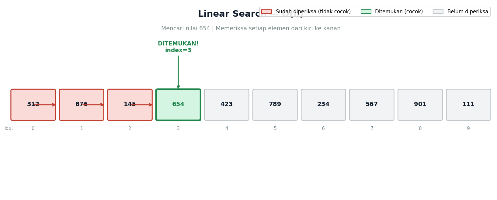
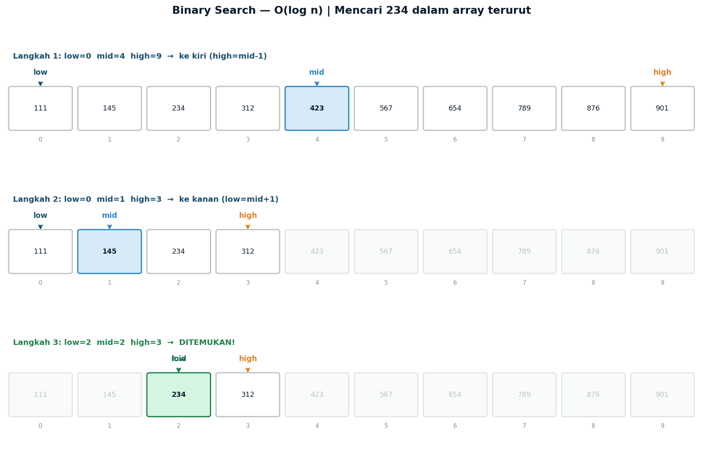
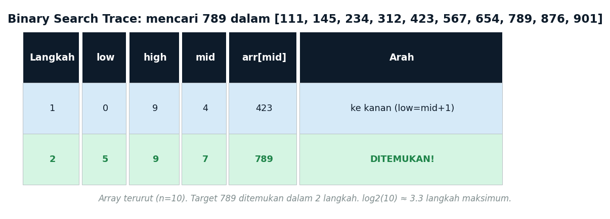
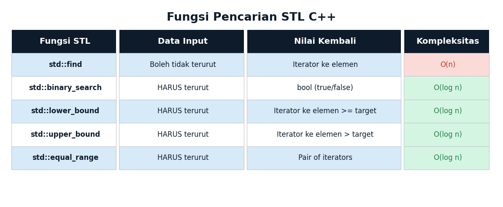
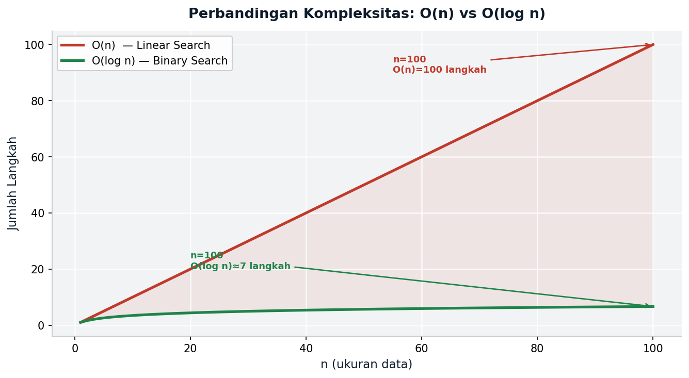

# Lecture 10 — Searching Algorithms
## *Linear Search · Binary Search · C++ STL*

**ENEE602004 · Algoritma Pemrograman dan Praktikum**
Dr. Alfan Presekal · Electrical Engineering · Universitas Indonesia

<div style="page-break-after: always;"></div>

---

# Topik yang Dibahas

- Linear Search — O(n), memeriksa setiap elemen satu per satu
- Binary Search — O(log n), divide-and-conquer (data harus terurut)
- Perbandingan performa: O(n) vs O(log n)
- C++ STL: `std::find`, `std::binary_search`, `std::lower_bound`
- Kapan menggunakan masing-masing algoritma

### File Demo

| File | Topik |
|------|-------|
| `src/01_linear_search.cpp` | Linear search pada data sensor |
| `src/02_binary_search.cpp` | Binary search + trace langkah |
| `src/03_stl_search.cpp` | STL: find, binary_search, lower_bound |
| `src/04_ee_adc_calibration.cpp` | Aplikasi EE: tabel kalibrasi ADC |

<div style="page-break-after: always;"></div>

---

# Motivasi: Mengapa Pencarian Penting?

Pencarian (searching) adalah operasi fundamental dalam sistem embedded dan pengolahan data:

- **Sensor lookup**: temukan nilai kalibrasi untuk pembacaan ADC tertentu
- **Threshold detection**: apakah tegangan melebihi batas aman?
- **Protocol parsing**: temukan header paket dalam buffer data serial
- **Control tables**: lookup PID gain berdasarkan kondisi sistem

### Dampak Performa pada Sistem Real-Time

- Linear Search O(n): n = 1.000 → ~1.000 langkah; n = 1.000.000 → ~1.000.000 langkah
- Binary Search O(log n): n = 1.000 → ~10 langkah; n = 1.000.000 → ~20 langkah

> Pada sistem embedded dengan clock 16 MHz, perbedaan O(n) vs O(log n) bisa berarti **real-time** vs **terlambat**.

<div style="page-break-after: always;"></div>

---

# Linear Search — O(n)

**Prinsip**: periksa setiap elemen dari kiri ke kanan hingga target ditemukan.



- Tidak memerlukan data terurut
- Kompleksitas waktu: **O(n)**
- Kasus terbaik: O(1) — target di index pertama
- Kasus terburuk: O(n) — target di akhir atau tidak ada

<div style="page-break-after: always;"></div>

---

# Linear Search — Implementasi

```cpp
// Memeriksa setiap elemen dari kiri ke kanan
// Mengembalikan index jika ditemukan, -1 jika tidak
int linearSearch(const vector<int>& arr, int target) {
    for (int i = 0; i < (int)arr.size(); i++) {
        if (arr[i] == target)
            return i;   // elemen ditemukan pada index i
    }
    return -1;          // elemen tidak ditemukan
}

// Penggunaan
vector<int> sensorData = {312, 876, 145, 654, 423, 789};
int idx = linearSearch(sensorData, 654);
// idx = 3 (index ke-3)

idx = linearSearch(sensorData, 999);
// idx = -1 (tidak ditemukan)
```

**Kapan gunakan linear search?**
- Data tidak terurut dan tidak perlu diurutkan
- Array kecil (n < 50) — overhead sorting tidak sepadan
- Pencarian satu kali saja (one-shot)

<div style="page-break-after: always;"></div>

---

# Binary Search — Konsep Divide-and-Conquer

**Prinsip**: bandingkan target dengan elemen tengah, eliminasi setengah array yang tidak relevan.



**Syarat wajib**: data **harus terurut** sebelum binary search.

- Setiap langkah mengeliminasi **setengah** data yang tersisa
- n = 1.000.000 hanya butuh maksimum **~20 langkah**
- Kompleksitas: **O(log n)**

<div style="page-break-after: always;"></div>

---

# Binary Search — Implementasi

```cpp
// Divide-and-conquer: memerlukan data terurut!
// Mengembalikan index jika ditemukan, -1 jika tidak
int binarySearch(const vector<int>& arr, int target) {
    int low = 0, high = (int)arr.size() - 1;

    while (low <= high) {
        // Hindari integer overflow dengan rumus ini
        int mid = low + (high - low) / 2;

        if      (arr[mid] == target) return mid;      // ditemukan!
        else if (arr[mid]  < target) low  = mid + 1;  // cari di kanan
        else                         high = mid - 1;  // cari di kiri
    }
    return -1; // tidak ditemukan
}

// Penggunaan — data HARUS diurutkan terlebih dahulu
vector<int> data = {312, 876, 145, 654, 423};
sort(data.begin(), data.end());
// data = {145, 312, 423, 654, 876}
int idx = binarySearch(data, 423);
// idx = 2
```

<div style="page-break-after: always;"></div>

---

# Binary Search — Trace Langkah Demi Langkah



**Penjelasan langkah**:
- `low` = batas kiri pencarian saat ini
- `high` = batas kanan pencarian saat ini
- `mid = low + (high - low) / 2` — hindari overflow
- Jika `arr[mid] < target` → geser `low = mid + 1`
- Jika `arr[mid] > target` → geser `high = mid - 1`
- Jika `low > high` → elemen tidak ada

<div style="page-break-after: always;"></div>

---

# STL Search Functions



- `std::find` — linear search, tidak memerlukan data terurut, mengembalikan iterator
- `std::binary_search` — hanya pada data terurut, mengembalikan `bool`
- `std::lower_bound` — hanya pada data terurut, mengembalikan iterator ke elemen >= target

<div style="page-break-after: always;"></div>

---

# STL Search Functions — Contoh Kode

```cpp
vector<int> data   = {312, 876, 145, 654, 423};
vector<int> sorted = {145, 312, 423, 654, 876};

// std::find — linear search, tidak perlu terurut
auto it = find(data.begin(), data.end(), 654);
if (it != data.end())
    cout << "index: " << distance(data.begin(), it); // 3

// std::binary_search — mengembalikan bool
bool found = binary_search(sorted.begin(), sorted.end(), 423);
// found = true

// std::lower_bound — iterator ke elemen pertama >= target
auto pos = lower_bound(sorted.begin(), sorted.end(), 400);
cout << "nilai pertama >= 400: " << *pos; // 423
```

<div style="page-break-after: always;"></div>

---

# Perbandingan Performa O(n) vs O(log n)



Pada n = 1.000.000: Linear Search membutuhkan ~1.000.000 langkah, Binary Search hanya ~20 langkah.

<div style="page-break-after: always;"></div>

---

# Cara Kompilasi dan Menjalankan Demo

### Kompilasi semua demo sekaligus
```bash
cd program/week10_searching
make
```

### Kompilasi dan jalankan satu per satu
```bash
# Demo 01 — linear search
g++ -std=c++17 -Wall -Isrc -o demo01 src/search_ops.cpp src/01_linear_search.cpp
./demo01

# Demo 02 — binary search + trace
g++ -std=c++17 -Wall -Isrc -o demo02 src/search_ops.cpp src/02_binary_search.cpp
./demo02

# Demo 03 — STL search functions
g++ -std=c++17 -Wall -Isrc -o demo03 src/search_ops.cpp src/03_stl_search.cpp
./demo03

# Demo 04 — EE ADC calibration
g++ -std=c++17 -Wall -Isrc -o demo04 src/search_ops.cpp src/04_ee_adc_calibration.cpp
./demo04
```

<div style="page-break-after: always;"></div>

---

# Perbandingan Linear vs Binary Search

| Kriteria | Linear Search | Binary Search |
|----------|--------------|---------------|
| **Kompleksitas** | O(n) | O(log n) |
| **Data terurut?** | Tidak perlu | Wajib |
| **Kasus terbaik** | O(1) | O(1) |
| **Kasus terburuk** | O(n) | O(log n) |
| **Implementasi** | Sangat sederhana | Lebih kompleks |
| **Cocok untuk** | Data kecil/tidak terurut | Data besar/sering dicari |
| **STL** | `std::find` | `std::binary_search` |

### Aturan Praktis

- n < 50: gunakan **linear search** (overhead sorting tidak sepadan)
- n > 1000 dan sering dicari: **urutkan sekali**, gunakan binary search
- Data berubah terus: pertimbangkan `std::set` atau `std::map` (O(log n) otomatis)

<div style="page-break-after: always;"></div>

---

# Ringkasan Kompleksitas

| Algoritma | Best | Average | Worst | Space |
|-----------|------|---------|-------|-------|
| Linear Search | O(1) | O(n) | O(n) | O(1) |
| Binary Search | O(1) | O(log n) | O(log n) | O(1) |
| `std::find` | O(1) | O(n) | O(n) | O(1) |
| `std::binary_search` | O(1) | O(log n) | O(log n) | O(1) |
| `std::lower_bound` | O(1) | O(log n) | O(log n) | O(1) |

> **Catatan**: Binary search memerlukan data terurut. Biaya sorting O(n log n) perlu diperhitungkan jika data belum terurut dan hanya dicari sekali.

<div style="page-break-after: always;"></div>

---

# Latihan Mandiri

**1.** Modifikasi `linearSearch` untuk mengembalikan **semua** index di mana target ditemukan (bukan hanya yang pertama). Gunakan `vector<int>` sebagai return type.

**2.** Implementasikan binary search secara **rekursif** (bukan iteratif). Bandingkan kedalaman rekursi untuk n = 1024.

**3.** Gunakan `std::lower_bound` untuk mengimplementasikan fungsi `insertSorted(vector<int>& arr, int val)` yang menyisipkan nilai ke posisi yang tepat agar array tetap terurut.

**4.** Buat fungsi `countOccurrences(vector<int>& sorted_arr, int target)` menggunakan `std::lower_bound` dan `std::upper_bound` untuk menghitung berapa kali target muncul dalam O(log n).

**5. (EE)** Perluas `04_ee_adc_calibration.cpp`: tambahkan fungsi `findVoltageRange(float v_min, float v_max)` yang mengembalikan semua titik kalibrasi yang tegangannya berada dalam rentang [v_min, v_max] menggunakan `std::lower_bound` dan `std::upper_bound`.

<div style="page-break-after: always;"></div>

---

# Referensi

- Stroustrup, B. (2013). *The C++ Programming Language*, 4th Ed. — Chapter 31 (STL Algorithms)
- Sedgewick, R. & Wayne, K. (2011). *Algorithms*, 4th Ed. — Chapter 3 (Searching)
- cppreference.com — [`std::find`](https://en.cppreference.com/w/cpp/algorithm/find), [`std::binary_search`](https://en.cppreference.com/w/cpp/algorithm/binary_search), [`std::lower_bound`](https://en.cppreference.com/w/cpp/algorithm/lower_bound)
- Cormen, T.H. et al. (2022). *Introduction to Algorithms*, 4th Ed. — Chapter 2 (Searching & Sorting)

### Materi Minggu Depan

**Week 11 — Sorting Algorithms**: Bubble Sort, Insertion Sort, Selection Sort, `std::sort`, dan aplikasi EE: median filter untuk sinyal ADC.
