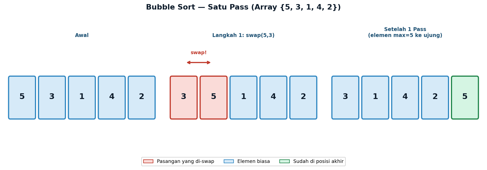
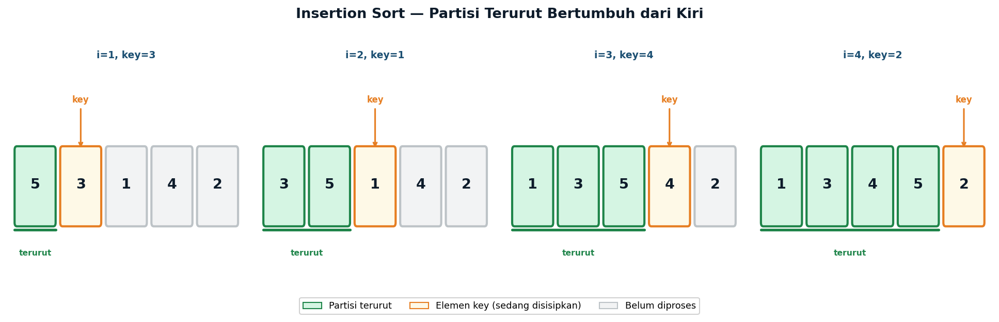
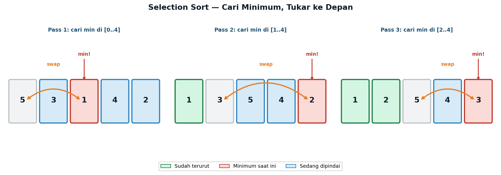
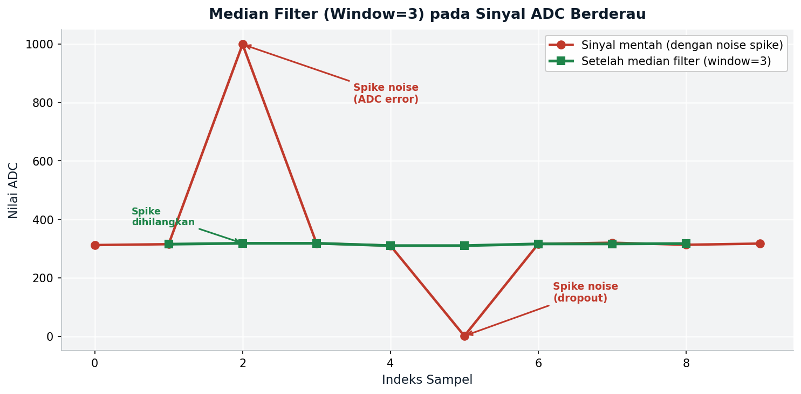
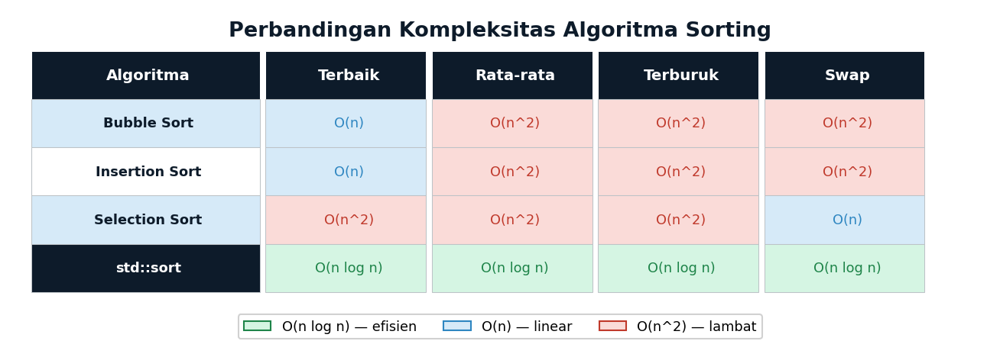

# Lecture 11 — Sorting Algorithms
## *Bubble Sort · Insertion Sort · Selection Sort · std::sort*

**ENEE602004 · Algoritma Pemrograman dan Praktikum**
Dr. Alfan Presekal · Electrical Engineering · Universitas Indonesia

<div style="page-break-after: always;"></div>

---

# Topik yang Dibahas

- Bubble Sort — O(n²), dengan optimasi early exit
- Insertion Sort — O(n²) rata-rata, O(n) untuk data hampir terurut
- Selection Sort — O(n²), swap minimal O(n), cocok untuk flash
- `std::sort` — O(n log n) Introsort, gunakan di produksi
- Aplikasi EE: median filter untuk noise impulsif sinyal ADC

### File Demo

| File | Topik |
|------|-------|
| `src/01_bubble_sort.cpp` | Bubble sort + trace langkah per pass |
| `src/02_insertion_sort.cpp` | Insertion sort + kasus hampir terurut |
| `src/03_selection_sort.cpp` | Selection sort + hitung swap |
| `src/04_ee_median_filter.cpp` | Aplikasi EE: median filter sinyal ADC |

<div style="page-break-after: always;"></div>

---

# Motivasi: Mengapa Sorting Penting?

Sorting adalah prasyarat untuk banyak algoritma efisien:

- **Binary search** memerlukan data terurut — O(log n) vs O(n)
- **Median filter** (EE): temukan nilai tengah dengan sorting window
- **Data visualization**: tampilkan pembacaan sensor dari kecil ke besar
- **Komunikasi**: transmit data terkompresi (data terurut lebih mudah dikompres)

### Klasifikasi Algoritma Sorting

| Kategori | Algoritma | Kompleksitas |
|----------|-----------|-------------|
| Simple sorts | Bubble, Insertion, Selection | O(n²) |
| Efficient sorts | Merge Sort, Quick Sort | O(n log n) |
| Non-comparison | Counting Sort, Radix Sort | O(n) |
| STL C++ | `std::sort` (Introsort) | O(n log n) |

> **Aturan praktis**: selalu gunakan `std::sort` di produksi. Pelajari O(n²) sorts untuk memahami prinsip dasarnya.

<div style="page-break-after: always;"></div>

---

# Bubble Sort — Algoritma

**Prinsip**: tukar pasangan elemen bersebelahan yang tidak terurut. Elemen terbesar "menggelembung" ke ujung kanan di setiap pass.



**Optimasi early exit**: jika tidak ada swap dalam satu pass, array sudah terurut — berhenti lebih awal.

- Kompleksitas rata-rata: **O(n²)**
- Kompleksitas terbaik: **O(n)** — data sudah terurut, satu pass tanpa swap

<div style="page-break-after: always;"></div>

---

# Bubble Sort — Implementasi

```cpp
// Tukar pasangan elemen bersebelahan yang tidak terurut
// Elemen terbesar "menggelembung" ke akhir di setiap pass
void bubbleSort(vector<int>& arr) {
    int n = arr.size();
    for (int i = 0; i < n - 1; i++) {
        bool swapped = false;  // optimasi: tandai apakah ada pertukaran
        for (int j = 0; j < n - i - 1; j++) {
            if (arr[j] > arr[j + 1]) {
                swap(arr[j], arr[j + 1]);
                swapped = true;
            }
        }
        if (!swapped) break;   // array sudah terurut, hentikan lebih awal
    }
}

// Trace output untuk {5,3,1,4,2}:
// Awal    : 5 3 1 4 2
// Pass 1  : 3 1 4 2 5   <- 5 ke akhir
// Pass 2  : 1 3 2 4 5   <- 4 ke posisi
// Pass 3  : 1 2 3 4 5   <- selesai
// (early exit — sudah terurut)
```

<div style="page-break-after: always;"></div>

---

# Insertion Sort — Konsep

**Prinsip**: kembangkan partisi terurut dari kiri. Ambil elemen berikutnya (key), sisipkan ke posisi yang tepat dalam partisi terurut.



- Partisi hijau (kiri): sudah terurut
- Elemen kuning: sedang disisipkan (key)
- Bagian abu-abu (kanan): belum diproses
- Elemen digeser ke kanan untuk membuat ruang bagi key

<div style="page-break-after: always;"></div>

---

# Insertion Sort — Implementasi

```cpp
// Kembangkan partisi terurut dari kiri satu per satu
// Ambil elemen berikutnya, geser yang lebih besar ke kanan
void insertionSort(vector<int>& arr) {
    int n = arr.size();
    for (int i = 1; i < n; i++) {
        int key = arr[i];  // elemen yang akan disisipkan
        int j   = i - 1;
        // Geser elemen yang lebih besar dari key ke kanan
        while (j >= 0 && arr[j] > key) {
            arr[j + 1] = arr[j];
            j--;
        }
        arr[j + 1] = key;   // tempatkan key di posisi yang tepat
    }
}
```

**Keunggulan insertion sort**:
- **O(n) pada data hampir terurut** — inner loop jarang berjalan
- Ideal untuk data stream real-time: tambah elemen baru ke array terurut
- **Stabil**: urutan elemen dengan nilai sama tetap terjaga
- Efisien untuk n kecil (n < 20): digunakan sebagai base case di std::sort

<div style="page-break-after: always;"></div>

---

# Selection Sort — Swap Minimal untuk Flash Memory

**Prinsip**: temukan elemen minimum di bagian tidak terurut, tukar ke posisi depan.



```cpp
// Temukan minimum, tukar ke depan — hanya O(n) swap total
void selectionSort(vector<int>& arr) {
    int n = arr.size();
    for (int i = 0; i < n - 1; i++) {
        int min_idx = i;
        for (int j = i + 1; j < n; j++)
            if (arr[j] < arr[min_idx]) min_idx = j;
        if (min_idx != i)
            swap(arr[i], arr[min_idx]);
    }
}
```

**Mengapa swap minimal penting?**
Flash/EEPROM memiliki batas siklus tulis (ATmega: ~100.000 write/byte). Selection sort menjamin maksimum **(n-1) swap** — paling sedikit dari semua O(n²) sort.

<div style="page-break-after: always;"></div>

---

# std::sort — O(n log n) Introsort

`std::sort` menggunakan **Introsort**: kombinasi Quicksort + Heapsort + Insertion Sort.

```cpp
#include <algorithm>
using namespace std;

vector<float> voltage = {3.2f, 1.5f, 4.8f, 2.1f, 3.9f, 0.7f};

// Urutan menaik (ascending)
sort(voltage.begin(), voltage.end());

// Urutan menurun (descending)
sort(voltage.begin(), voltage.end(), greater<float>());

// Custom comparator — urutkan struct berdasarkan field
struct Reading { int channel; float value; };
vector<Reading> readings = {{2,3.1f},{0,1.5f},{4,4.8f},{1,2.2f}};
sort(readings.begin(), readings.end(),
     [](const Reading& a, const Reading& b){
         return a.value < b.value;
     });
```

**Selalu gunakan `std::sort` di kode produksi** — O(n log n) worst case, dioptimasi untuk cache CPU modern.

<div style="page-break-after: always;"></div>

---

# Cara Kompilasi dan Menjalankan Demo

### Kompilasi semua demo sekaligus
```bash
cd program/week11_sorting
make
```

### Kompilasi dan jalankan satu per satu
```bash
# Demo 01 — bubble sort + trace
g++ -std=c++17 -Wall -Isrc -o demo01 src/sort_ops.cpp src/01_bubble_sort.cpp
./demo01

# Demo 02 — insertion sort
g++ -std=c++17 -Wall -Isrc -o demo02 src/sort_ops.cpp src/02_insertion_sort.cpp
./demo02

# Demo 03 — selection sort + hitung swap
g++ -std=c++17 -Wall -Isrc -o demo03 src/sort_ops.cpp src/03_selection_sort.cpp
./demo03

# Demo 04 — EE median filter
g++ -std=c++17 -Wall -Isrc -o demo04 src/sort_ops.cpp src/04_ee_median_filter.cpp
./demo04
```

<div style="page-break-after: always;"></div>

---

# Aplikasi EE: Median Filter

**Masalah**: sinyal ADC terkontaminasi noise impulsif (spike) dari interferensi elektromagnetik atau koneksi longgar.

**Solusi**: Median filter — urutkan window sliding, ambil nilai tengah (median).



**Algoritma**: untuk setiap sampel i, ambil window [i-1, i, i+1], urutkan, kembalikan nilai tengah. Spike dieliminasi karena nilai ekstrem selalu di ujung array terurut.

<div style="page-break-after: always;"></div>

---

# Perbandingan Algoritma Sorting



| Kapan gunakan |  |
|---------------|--|
| **Bubble Sort** | Edukasi, data sangat kecil, deteksi "sudah terurut" |
| **Insertion Sort** | Data hampir terurut, stream data, n < 20 |
| **Selection Sort** | Flash/EEPROM embedded, jumlah swap kritis |
| **std::sort** | Semua kasus produksi — selalu pilihan pertama |

<div style="page-break-after: always;"></div>

---

# Ringkasan Kompleksitas

| Algoritma | Best | Average | Worst | Swap | Stabil? |
|-----------|------|---------|-------|------|---------|
| Bubble Sort | O(n) | O(n²) | O(n²) | O(n²) | Ya |
| Insertion Sort | O(n) | O(n²) | O(n²) | O(n²) | Ya |
| Selection Sort | O(n²) | O(n²) | O(n²) | **O(n)** | Tidak |
| `std::sort` | O(n log n) | O(n log n) | O(n log n) | O(n log n) | Tidak |
| `std::stable_sort` | O(n log n) | O(n log n) | O(n log n) | O(n log n) | **Ya** |

> **Catatan**: Gunakan `std::stable_sort` jika stabilitas diperlukan (urutan elemen sama tetap terjaga) dengan performa O(n log n).

<div style="page-break-after: always;"></div>

---

# Latihan Mandiri

**1.** Modifikasi `bubbleSort` untuk mengurutkan secara **menurun** (descending). Uji dengan vector `{3, 1, 4, 1, 5, 9, 2, 6}`.

**2.** Implementasikan **counting sort** untuk array integer dengan nilai 0–255 (representasi data ADC 8-bit). Bandingkan kecepatannya dengan `std::sort`.

**3.** Buat fungsi `sortByField` yang menggunakan `std::sort` dengan lambda untuk mengurutkan `vector<struct>` berdasarkan field yang dipilih saat runtime.

**4.** Ukur dan bandingkan waktu eksekusi keempat algoritma (bubble, insertion, selection, std::sort) untuk n = {100, 1000, 5000} menggunakan `std::chrono`. Buat tabel hasilnya.

**5. (EE)** Perluas `04_ee_median_filter.cpp`: implementasikan median filter dengan **window size variabel** (3, 5, 7). Bandingkan hasilnya pada sinyal ADC yang sama dan diskusikan trade-off antara efektivitas penghilangan noise dan latensi.

<div style="page-break-after: always;"></div>

---

# Referensi

- Stroustrup, B. (2013). *The C++ Programming Language*, 4th Ed. — Chapter 31 (STL Algorithms)
- Sedgewick, R. & Wayne, K. (2011). *Algorithms*, 4th Ed. — Chapter 2 (Sorting)
- cppreference.com — [`std::sort`](https://en.cppreference.com/w/cpp/algorithm/sort), [`std::stable_sort`](https://en.cppreference.com/w/cpp/algorithm/stable_sort)
- Cormen, T.H. et al. (2022). *Introduction to Algorithms*, 4th Ed. — Chapter 2 & 6 (Sorting)

### Materi Minggu Depan

**Week 12 — Object-Oriented Programming I**: Class, object, encapsulation, constructor, destructor, dan penerapannya dalam sistem embedded.
