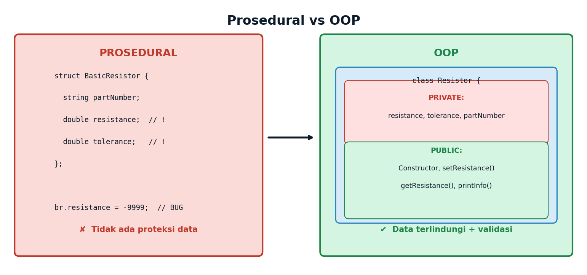
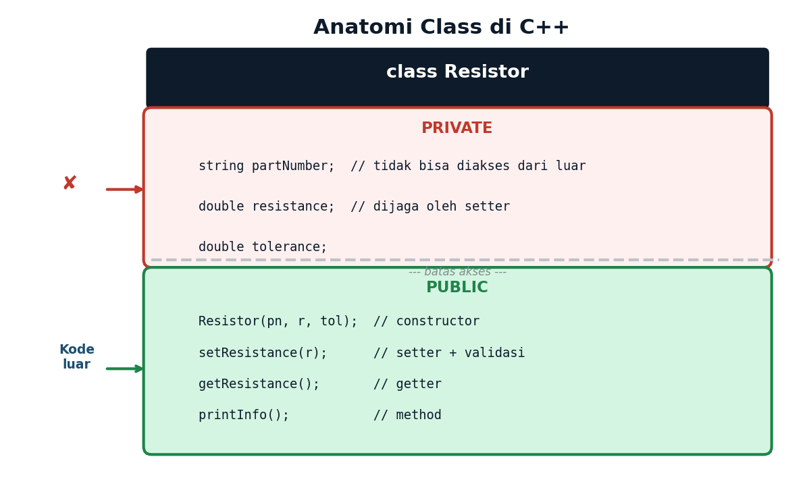
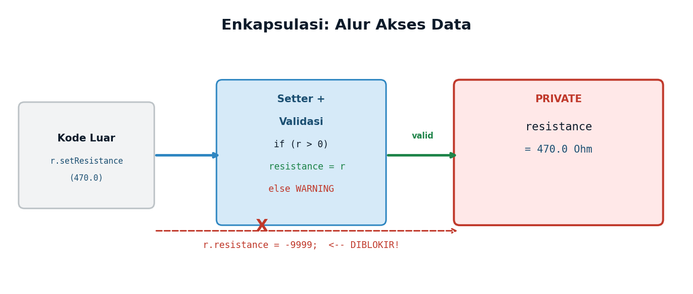

# Lecture 12 — Object-Oriented Programming (1)
## *Abstraction · Encapsulation · Constructors · C++ class*

**ENEE602004 · Algoritma Pemrograman dan Praktikum**
Dr. Alfan Presekal · Electrical Engineering · Universitas Indonesia

<div style="page-break-after: always;"></div>

---

# Topik yang Dibahas

- Prosedural vs OOP — mengapa kita membutuhkan class
- Keyword `class` — mendefinisikan blueprint
- **Abstraction** — menyembunyikan kompleksitas, antarmuka publik
- **Encapsulation** — data private + getter/setter + validasi
- **Constructor** — inisialisasi otomatis saat objek dibuat
- **Method overloading** — nama sama, parameter berbeda

### File Demo
| File | Topik |
|------|-------|
| `src/01_basic_class.cpp` | Basic class — public members, silent bug |
| `src/02_encapsulation.cpp` | Encapsulation: private + constructor + setter |
| `src/03_overloading.cpp` | Constructor dan method overloading |
| `src/04_ee_voltage_divider.cpp` | Aplikasi EE: voltage divider |

<div style="page-break-after: always;"></div>

---

# Mengapa OOP? Prosedural vs OOP



**Masalah prosedural:** data dapat diubah langsung dari luar tanpa validasi.

**Solusi OOP:** sembunyikan data, ekspos hanya interface yang aman.

<div style="page-break-after: always;"></div>

---

# Anatomi Class: Blueprint vs Object



- **Class** = blueprint (cetakan). **Object** = instansi dari blueprint.
- Setiap class punya **private section** (data) dan **public section** (interface).
- Batas akses dijaga oleh compiler — pelanggaran = compile error.

<div style="page-break-after: always;"></div>

---

# Encapsulation: Data Private + Interface Public



**Tiga aturan enkapsulasi:**
1. Data field → **private** (tidak bisa diakses langsung dari luar)
2. Akses data → melalui **setter** (dengan validasi) dan **getter** (baca saja)
3. Inisialisasi → melalui **constructor**

<div style="page-break-after: always;"></div>

---

# Encapsulation — Kode Resistor

```cpp
class Resistor {
private:                             //  <-- data terlindungi
    string partNumber;
    double resistance;  // selalu > 0, dijaga setter
    double tolerance;
public:                              //  <-- interface publik
    Resistor(const string& pn, double r, double tol = 5.0)
        : partNumber(pn), resistance(0.0), tolerance(tol)
    { setResistance(r); }            // validasi lewat setter
    void setResistance(double r) {   // setter + validasi
        if (r > 0) resistance = r;
        else cout << "WARNING: nilai tidak valid\n";
    }
    double getResistance() const { return resistance; }
    void printInfo() const;
};
```

<div style="page-break-after: always;"></div>

---

# Constructor: Inisialisasi Otomatis

```cpp
// Member-initializer list (:) lebih efisien dari assignment di body
Resistor(const string& pn, double r, double tol = 5.0)
    : partNumber(pn),   // 1. inisialisasi partNumber
      resistance(0.0),  // 2. inisialisasi resistance (divalidasi kemudian)
      tolerance(tol)    // 3. inisialisasi tolerance
{
    setResistance(r);   // validasi melalui setter
}

// Penggunaan:
Resistor r1("R-470",  470.0, 1.0);   // OK
Resistor r2("R-1k",  1000.0);         // OK, tolerance default = 5%
Resistor r3("R-BAD",   -50.0);        // WARNING: nilai negatif diabaikan
// r3.resistance = 100;               // ERROR: 'resistance' is private
```

> **Aturan:** Jika class memiliki data yang perlu validasi, selalu gunakan constructor — jangan biarkan objek dibuat dalam kondisi tidak valid.

<div style="page-break-after: always;"></div>

---

# Constructor Overloading: Kapasitor

```cpp
class Capacitor {
private:
    string partNumber;
    double capacitance;    // Farads
    double voltageRating;  // Volts
public:
    // Overload 1: 3 argumen (pn, c, vRating)
    Capacitor(const string& pn, double c, double vR)
        : partNumber(pn), capacitance(c), voltageRating(vR) {}
    // Overload 2: 2 argumen — voltageRating = 50V (default)
    Capacitor(const string& pn, double c)
        : partNumber(pn), capacitance(c), voltageRating(50.0) {}
    // Overload 3: 0 argumen — semua default
    Capacitor() : partNumber("C-?"), capacitance(0), voltageRating(50) {}
    void printInfo() const;  // output: pn, uF, V
};
```

<div style="page-break-after: always;"></div>

---

# Method Overloading: ADCSensor

```cpp
class ADCSensor {
private:
    int   resolution;  // bit — misal 12 untuk ADC 12-bit
    float vRef;        // tegangan referensi (Volt)
public:
    ADCSensor(int res, float vref) : resolution(res), vRef(vref) {}
    // Overload 1: raw int (tanpa argumen)
    int readRaw() const { return 2048; }  // simulasi
    // Overload 2: ke Volt, pakai vRef tersimpan
    float readVoltage() const
        { return readRaw()/float((1<<resolution)-1)*vRef; }
    // Overload 3: ke Volt, vRef kustom dari pemanggil
    float readVoltage(float vRef2) const
        { return readRaw()/float((1<<resolution)-1)*vRef2; }
};
```

<div style="page-break-after: always;"></div>

---

# Cara Kompilasi

**Menggunakan Makefile (direkomendasikan):**
```bash
cd <path>/week12_oop1
make            # kompilasi semua demo
make run01      # demo basic class
make run02      # demo encapsulation
make run03      # demo overloading
make run04      # demo EE voltage divider
```

**Kompilasi manual (masing-masing demo tidak memerlukan ops.cpp):**
```bash
g++ -std=c++17 -Wall -Isrc -o demo02 src/02_encapsulation.cpp
./demo02
```

**Struktur folder:**
```
week12_oop1/
├── src/   oop1.h  01_basic_class.cpp  02_encapsulation.cpp
│          03_overloading.cpp  04_ee_voltage_divider.cpp
└── Makefile
```

<div style="page-break-after: always;"></div>

---

# Ringkasan: Aturan Enkapsulasi

| Konsep | Keterangan | Contoh |
|--------|-----------|--------|
| Data `private` | Tidak bisa diakses dari luar class | `resistance`, `tolerance` |
| Constructor | Inisialisasi objek secara otomatis | `Resistor("R-470", 470.0)` |
| Member-init list | Lebih efisien dari assignment di body | `: partNumber(pn)` |
| Setter + validasi | Satu-satunya cara mengubah data | `setResistance(r)` |
| Getter `const` | Baca data, tidak mengubah objek | `getResistance()` |
| `printInfo() const` | Method yang tidak mengubah state | Aman pada const object |
| Overloading | Nama sama, parameter berbeda | 3 versi `readVoltage()` |
| Compile error | Akses private dari luar diblokir | `r.resistance = 100` |

<div style="page-break-after: always;"></div>

---

# Latihan Mandiri

**1.** Buat class `Inductor` dengan data private `inductance` (Henry) dan `current` (Ampere). Tambahkan constructor, setter dengan validasi, getter, dan `printInfo()`.

**2.** Buat class `Battery` dengan `voltage` dan `capacity` (mAh). Tambahkan method `getEnergy()` yang menghitung energi dalam Joule (V * capacity * 3.6).

**3.** Buat class `LED` dengan 3 constructor overload: spesifikasi lengkap, default brightness=100%, dan default semua.

**4.** Buat class `Converter` dengan method overloading `convert()`: Celsius→Fahrenheit (C*9/5+32), dan Celsius→Kelvin (C+273.15).

**5. [EE]** Buat class `VoltageSource` (tegangan & impedansi internal). Implementasikan `getTerminalVoltage(double loadR)` menggunakan pembagi tegangan dengan impedansi internal.

<div style="page-break-after: always;"></div>

---

# Referensi dan Eksplorasi Lebih Lanjut

- Stroustrup, B. (2013). *The C++ Programming Language* (4th ed.). Addison-Wesley.
- Lippman, Lajoie, Moo. (2012). *C++ Primer* (5th ed.). Addison-Wesley.
- [LearnCpp.com — Chapter 13: OOP Introduction](https://www.learncpp.com/cpp-tutorial/introduction-to-object-oriented-programming/)
- [cppreference — class declaration](https://en.cppreference.com/w/cpp/language/class)
- [GeeksforGeeks — OOP in C++](https://www.geeksforgeeks.org/object-oriented-programming-in-cpp/)
