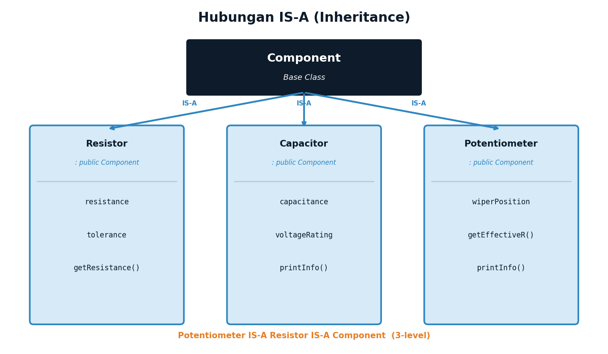
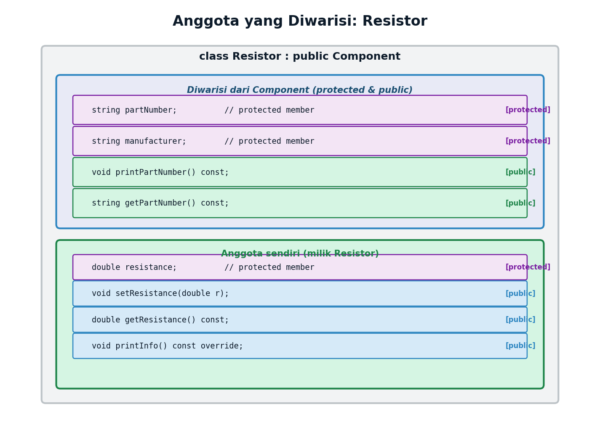
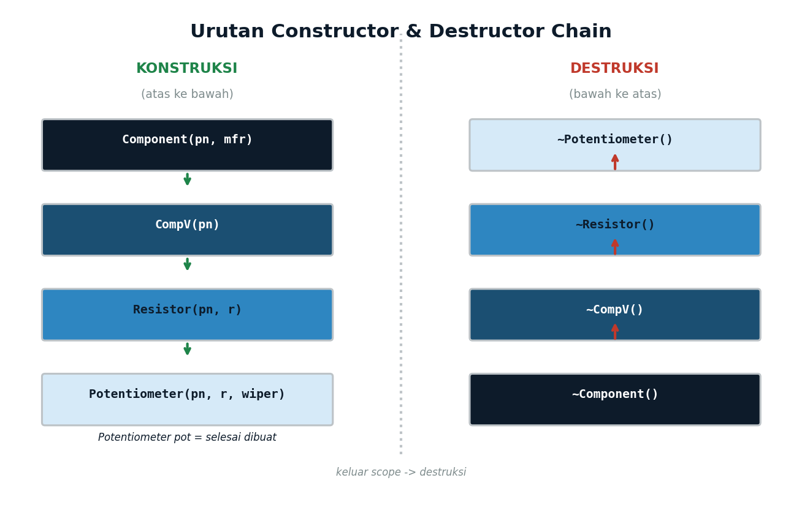
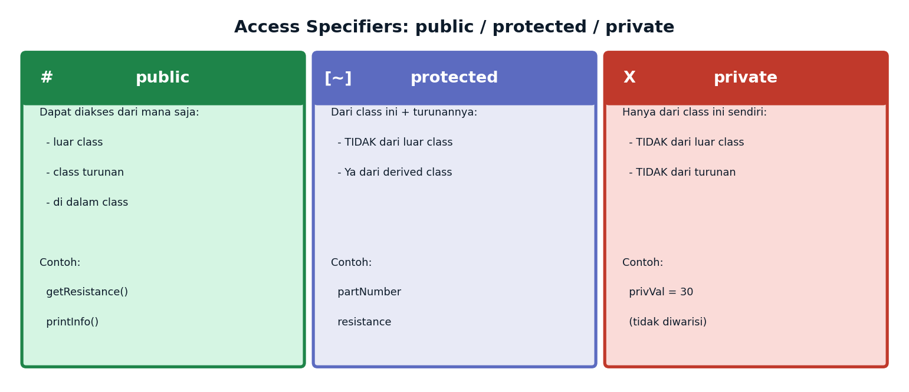
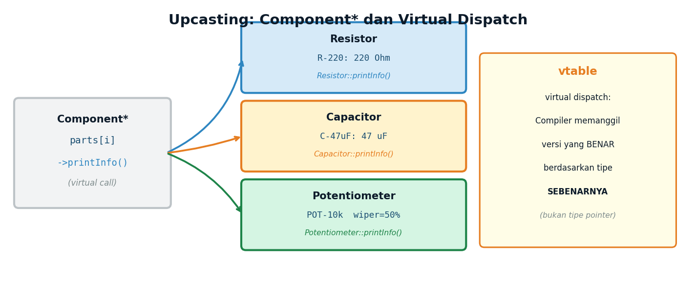

# Lecture 13 — Object-Oriented Programming (2)
## *Inheritance — Code Reuse Through Class Hierarchies*

**ENEE602004 · Algoritma Pemrograman dan Praktikum**
Dr. Alfan Presekal · Electrical Engineering · Universitas Indonesia

<div style="page-break-after: always;"></div>

---

# Topik yang Dibahas

- Konsep **inheritance** — hubungan IS-A
- Sintaks base class dan derived class di C++
- Access specifiers: `public` / `protected` / `private`
- Constructor chain — parent selalu dikonstruksi lebih dulu
- Destructor chain — child didestruksi lebih dulu
- Method overriding dengan keyword `override`
- Multi-level inheritance

### File Demo
| File | Topik |
|------|-------|
| `src/01_basic_inheritance.cpp` | Inheritance dasar, override |
| `src/02_constructor_chain.cpp` | Urutan ctor/dtor |
| `src/03_access_specifiers.cpp` | public/protected/private, upcasting |
| `src/04_ee_potentiometer.cpp` | EE: Potentiometer 3-level inheritance |

<div style="page-break-after: always;"></div>

---

# Konsep Inheritance: Hubungan IS-A



- **Inheritance:** derived class mewarisi member dari base class.
- Hubungan **IS-A**: Resistor IS-A Component, Potentiometer IS-A Resistor.
- Kode yang sudah ditulis di base class tidak perlu ditulis ulang.
- Uji IS-A: "Potentiometer adalah sebuah Resistor" ✓ → gunakan inheritance

<div style="page-break-after: always;"></div>

---

# Sintaks Inheritance di C++

```cpp
// BASE CLASS — Component
class Component {
protected:
    string partNumber;   // 'protected': accessible di derived class
public:
    Component(const string& pn) : partNumber(pn) {}
    virtual void printInfo() const {
        cout << "Komponen: " << partNumber << endl;
    }
    virtual ~Component() {}  // virtual destructor WAJIB!
};

// DERIVED CLASS — Resistor : public Component
class Resistor : public Component {
protected:
    double resistance;
public:
    Resistor(const string& pn, double r)
        : Component(pn),    // panggil ctor parent lebih dulu!
          resistance(r) {}

    void printInfo() const override {   // override method parent
        cout << "Resistor [" << partNumber << "]: "
             << resistance << " Ohm\n";
    }
};
```

<div style="page-break-after: always;"></div>

---

# Anggota yang Diwarisi



- Anggota `protected` Component (`partNumber`, `manufacturer`) dapat diakses di Resistor.
- Anggota `public` Component (`printPartNumber()`, `getPartNumber()`) tersedia di Resistor tanpa ditulis ulang.
- Resistor menambah anggotanya sendiri: `resistance`, `tolerance`, `setResistance()`, dll.

<div style="page-break-after: always;"></div>

---

# Constructor & Destructor Chain



**Aturan urutan:**
- **Constructor:** dari class paling ATAS ke bawah — Component → Resistor → Potentiometer
- **Destructor:** dari class paling BAWAH ke atas, urutan **TERBALIK** — ~Potentiometer → ~Resistor → ~Component

Setiap constructor memanggil constructor parent di **initializer list**.

<div style="page-break-after: always;"></div>

---

# Constructor Chain — Kode

```cpp
class Base {
public:
    Base()  { cout << "Base ctor\n";  }
    ~Base() { cout << "Base dtor\n";  }
};

class Child : public Base {
public:
    Child()  : Base() { cout << "Child ctor\n"; }  // Base dipanggil dulu!
    ~Child()          { cout << "Child dtor\n"; }
};

// Output saat: { Child c; }
// Base ctor       <- ctor dari atas
// Child ctor
// (scope exit)
// Child dtor      <- dtor dari bawah
// Base dtor
```

> Destructor berjalan **terbalik** dari constructor. Ini memastikan resource yang dialokasikan oleh parent dibersihkan **setelah** child selesai.

<div style="page-break-after: always;"></div>

---

# Access Specifiers: public / protected / private



| Specifier | Dalam class | Di derived class | Luar class |
|-----------|------------|------------------|------------|
| `public`    | Ya | Ya | Ya |
| `protected` | Ya | Ya | **Tidak** |
| `private`   | Ya | **Tidak** | **Tidak** |

- `partNumber`, `manufacturer` → **`protected`** (bisa diakses di derived class)
- Data sensitif / detail implementasi → **`private`**
- Interface (constructor, getter, `printInfo`) → **`public`**

<div style="page-break-after: always;"></div>

---

# Upcasting: Component*



```cpp
// Upcasting: base class pointer ke derived object
Component* parts[3];
parts[0] = new Resistor("R-220", 220.0);
parts[1] = new Capacitor("C-47uF", 47e-6, 25.0);
parts[2] = new Potentiometer("POT-1k", 1000.0, 0.3);

// Virtual dispatch: memanggil versi yang tepat secara otomatis
for (int i = 0; i < 3; i++) {
    parts[i]->printInfo();   // Resistor::printInfo() dll.
}

// Virtual destructor: memastikan ~Resistor, ~Capacitor, ~Potentiometer
// dipanggil (bukan hanya ~Component)
for (int i = 0; i < 3; i++) {
    delete parts[i];
}
```

<div style="page-break-after: always;"></div>

---

# Multi-Level Inheritance: Potentiometer

```cpp
// Potentiometer : Resistor : Component  (3 level)
class Potentiometer : public Resistor {
private:
    double wiperPosition;  // 0.0 (GND) sampai 1.0 (VCC)
public:
    Potentiometer(const string& pn, double r, double wiper = 0.5)
        : Resistor(pn, r),     // Resistor memanggil Component secara internal
          wiperPosition(wiper) {}

    void setWiper(double pos) {
        if (pos >= 0.0 && pos <= 1.0) wiperPosition = pos;
    }
    double getEffectiveResistance() const {
        return resistance * wiperPosition;  // 'resistance' diwarisi dari Resistor
    }
    void printInfo() const override {
        Resistor::printInfo();  // panggil versi parent dulu
        cout << "  Wiper: " << wiperPosition * 100 << "% -> "
             << getEffectiveResistance() << " Ohm efektif\n";
    }
};
```

<div style="page-break-after: always;"></div>

---

# Cara Kompilasi

**Menggunakan Makefile:**
```bash
cd <path>/week13_oop2
make            # kompilasi semua demo
make run01      # inheritance dasar
make run02      # constructor chain
make run03      # access specifiers + upcasting
make run04      # EE: potentiometer voltage divider
```

**Kompilasi manual (setiap demo self-contained):**
```bash
g++ -std=c++17 -Wall -Isrc -o demo01 src/01_basic_inheritance.cpp
./demo01
```

**Struktur folder:**
```
week13_oop2/
├── src/   oop2.h  01_basic_inheritance.cpp  02_constructor_chain.cpp
│          03_access_specifiers.cpp  04_ee_potentiometer.cpp
└── Makefile
```

<div style="page-break-after: always;"></div>

---

# Ringkasan Inheritance

| Konsep | Penjelasan | Contoh |
|--------|-----------|--------|
| Inheritance | Derived mewarisi base class | `class Resistor : public Component` |
| IS-A | Hubungan turunan ke dasar | Resistor IS-A Component |
| `override` | Ganti virtual method | `void printInfo() const override` |
| Constructor chain | Ctor dari atas ke bawah | Component → Resistor → Pot |
| Destructor chain | Dtor dari bawah ke atas | ~Pot → ~Resistor → ~Component |
| `protected` | Accessible dari derived | `partNumber` bisa diakses Resistor |
| Upcasting | `Base*` ke derived object | `Component* p = new Resistor(...)` |
| Virtual dispatch | Memanggil override tepat | `p->printInfo()` → Resistor versi |
| Virtual dtor | Cleanup benar via base ptr | `virtual ~Component()` |

<div style="page-break-after: always;"></div>

---

# Latihan Mandiri

**1.** Buat class `Sensor` (base, `sensorName` protected). Turunkan `TemperatureSensor` dengan `temperature` dan `unit`. Override `printInfo()`.

**2.** Tambahkan pesan ctor/dtor ke `Sensor` dan `TemperatureSensor`. Amati urutan output ctor dan dtor.

**3.** Buat class `DigitalSensor : TemperatureSensor` dengan state `isCalibrated` (bool). Tambahkan method `calibrate()`. Akses protected member dari base.

**4.** Buat array `Sensor*` berisi 3 object berbeda. Panggil `printInfo()` via pointer. Hapus semua dengan `delete`.

**5. [EE]** Buat class `LoadedVoltageSource`. Tambahkan `Resistor` sebagai member (komposisi). Implementasikan `getVout(double loadR)` yang menghitung Vout dengan loading effect.

<div style="page-break-after: always;"></div>

---

# Referensi dan Eksplorasi Lebih Lanjut

- Stroustrup, B. (2013). *The C++ Programming Language* (4th ed.). Addison-Wesley.
- Lippman, Lajoie, Moo. (2012). *C++ Primer* (5th ed.). Addison-Wesley.
- [LearnCpp.com — Chapter 17: Inheritance](https://www.learncpp.com/cpp-tutorial/introduction-to-inheritance/)
- [cppreference — Derived classes, access specifiers](https://en.cppreference.com/w/cpp/language/derived_class)
- [GeeksforGeeks — Inheritance in C++](https://www.geeksforgeeks.org/inheritance-in-c/)
- [VisuAlgo — tidak tersedia untuk OOP, gunakan: programiz.com C++ Inheritance]
