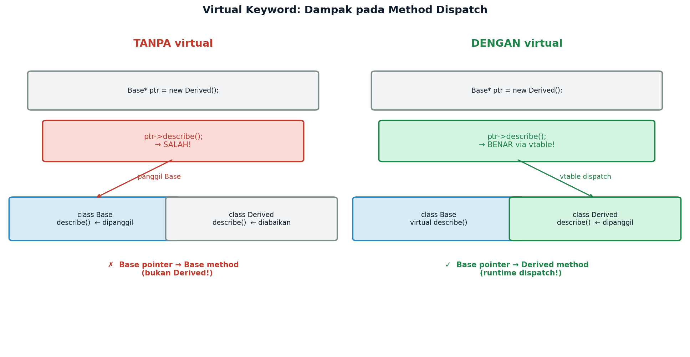
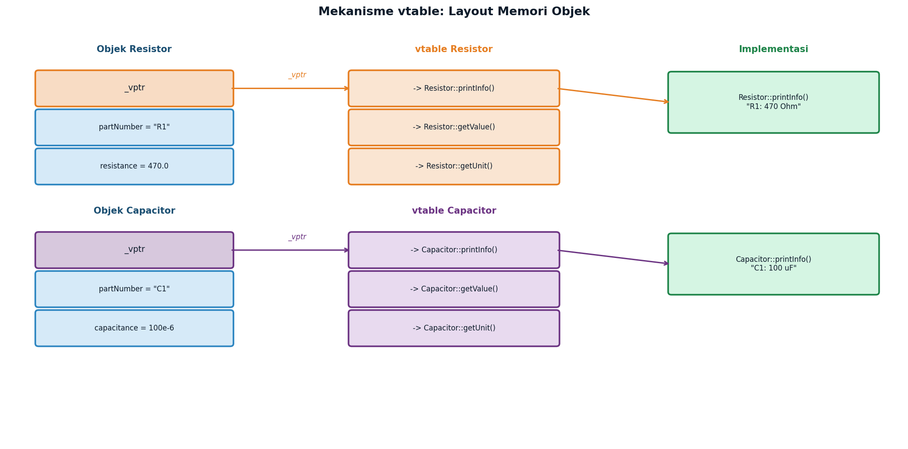
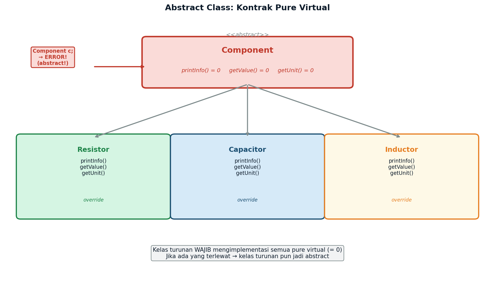
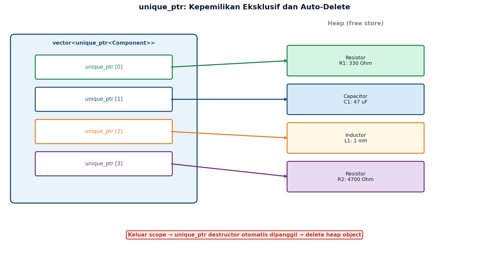
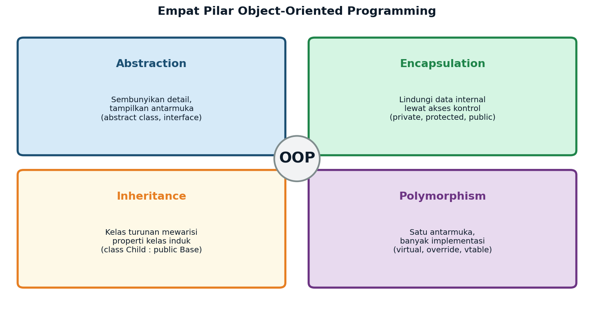

# Week 14 — Object-Oriented Programming (3)
## *Virtual, Abstract Class, dan Polymorphism dalam C++*

**ENEE602004 · Algoritma Pemrograman dan Praktikum**
Dr. Alfan Presekal · Teknik Elektro · Universitas Indonesia

<div style="page-break-after: always;"></div>

---

# Topik yang Dibahas

- Masalah tanpa `virtual`: base pointer memanggil versi salah
- Keyword `virtual` dan mekanisme vtable (runtime dispatch)
- Abstract class: pure virtual function (`= 0`)
- Polymorphism: satu loop untuk banyak tipe komponen
- Virtual destructor: mencegah memory leak
- Modern C++: `unique_ptr` dan `make_unique`
- Aplikasi EE: Bill of Materials (BOM) analyzer

### File Demo

| File | Topik |
|------|-------|
| `src/01_virtual_dispatch.cpp` | Without vs with `virtual`: perbedaan dispatch |
| `src/02_abstract_class.cpp` | Pure virtual, abstract class, array polimorfik |
| `src/03_unique_ptr.cpp` | `unique_ptr` + polymorphism, auto-delete |
| `src/04_ee_bom_analyzer.cpp` | Aplikasi: BOM analyzer (Resistor/Capacitor/Inductor) |

<div style="page-break-after: always;"></div>

---

# Masalah: Satu Loop, Banyak Tipe

Dalam rangkaian elektronik, kita memiliki banyak jenis komponen: Resistor, Kapasitor, Induktor. Semua perlu diproses dalam satu loop yang sama.

**Tanpa polymorphism:** perlu `if/else` per tipe — tidak skalabel:

```cpp
// Cara lama — tidak skalabel
for (int i = 0; i < n; i++) {
    if (type[i] == "R")
        printResistor(circuit[i]);
    else if (type[i] == "C")
        printCapacitor(circuit[i]);
    // tambah tipe baru = ubah semua loop
}
```

**Dengan polymorphism** — satu baris, semua tipe: `circuit[i]->printInfo();`

**Solusi:** Abstract base class + virtual function → satu antarmuka, banyak implementasi.

<div style="page-break-after: always;"></div>

---

# Virtual Keyword: Runtime Dispatch



**Tanpa `virtual`:** pointer base selalu memanggil metode base, meskipun objek sebenarnya adalah turunan.

**Dengan `virtual`:** compiler membuat **vtable** — tabel pointer ke fungsi yang tepat. Dipilih saat runtime sesuai tipe objek sebenarnya.

<div style="page-break-after: always;"></div>

---

# Mekanisme vtable



Setiap objek dengan `virtual` method menyimpan pointer tersembunyi `_vptr` yang menunjuk ke **vtable** kelasnya. Saat `ptr->printInfo()` dipanggil, CPU membaca `_vptr` → cari `printInfo` di vtable → lompat ke implementasi yang tepat. Inilah **runtime dispatch**.

<div style="page-break-after: always;"></div>

---

# Abstract Class: Pure Virtual Function



Pure virtual (`= 0`) menjadikan kelas **abstrak**: tidak bisa diinstansiasi, hanya bisa diwariskan. Kelas turunan **wajib** mengimplementasi semua pure virtual, jika tidak → kelas turunan juga abstrak.

<div style="page-break-after: always;"></div>

---

# Abstract Class — Kode

```cpp
// Kelas abstrak: mendefinisikan kontrak komponen EE
class Component {
protected:
    string partNumber;
public:
    explicit Component(const string& pn) : partNumber(pn) {}
    virtual void   printInfo() const = 0;  // pure virtual
    virtual double getValue()  const = 0;
    virtual string getUnit()   const = 0;
    virtual ~Component() = default;        // virtual destructor wajib!
};

// Kelas konkret: WAJIB implementasi semua pure virtual
class Resistor : public Component {
    double resistance;
public:
    Resistor(const string& pn, double r) : Component(pn), resistance(r) {}
    void   printInfo() const override {
        cout << "Resistor [" << partNumber << "]: " << resistance << " Ohm\n";
    }
    double getValue() const override { return resistance; }
    string getUnit()  const override { return "Ohm"; }
};
// Component c("X");  // ERROR: abstract class tidak bisa diinstansiasi
```

<div style="page-break-after: always;"></div>

---

# Polymorphism in Action

Kunci polymorphism: **pointer base menunjuk ke objek turunan**, panggil metode → vtable dispatch ke implementasi yang tepat.

```cpp
// Array pointer base — menyimpan berbagai tipe turunan
Component* circuit[3];
circuit[0] = new Resistor ("R1", 470.0);
circuit[1] = new Capacitor("C1", 100e-6);
circuit[2] = new Inductor ("L1",  10e-3);

// Satu loop — tidak peduli tipe spesifik
cout << "Bill of Materials:" << endl;
for (int i = 0; i < 3; i++)
    circuit[i]->printInfo();  // runtime dispatch via vtable

// Akses nilai secara generik — kontrak dari abstract class
for (int i = 0; i < 3; i++) {
    cout << circuit[i]->getPartNumber()
         << " = " << circuit[i]->getValue()
         << " " << circuit[i]->getUnit() << endl;
}

// Cleanup — virtual destructor memastikan dtor turunan dipanggil
for (int i = 0; i < 3; i++) delete circuit[i];
```

<div style="page-break-after: always;"></div>

---

# Virtual Destructor: Mencegah Memory Leak

Tanpa `virtual` destructor, `delete` lewat pointer base hanya memanggil destruktor base — destruktor turunan **tidak dipanggil** → **memory leak!**

```cpp
class Base {
public:
    ~Base() { cout << "~Base()\n"; }   // TANPA virtual — BAHAYA!
};
class Derived : public Base {
    int* data;
public:
    Derived() : data(new int[100]) {}
    ~Derived() {
        delete[] data;                 // TIDAK dipanggil jika delete Base*
        cout << "~Derived()\n";
    }
};
Base* p = new Derived();
delete p;  // tanpa virtual: hanya ~Base() → data BOCOR!
```

**Solusi:** tambahkan `virtual ~ClassName() = default;` di kelas base:

```cpp
class SafeBase {
public:
    virtual ~SafeBase() = default;     // virtual destructor — AMAN
};
// delete SafeBase* → ~Derived() + ~SafeBase() keduanya dipanggil ✓
```

<div style="page-break-after: always;"></div>

---

# Modern C++: unique_ptr



`unique_ptr<T>` adalah **smart pointer**: memiliki objek secara eksklusif dan **otomatis menghapus** saat keluar scope. Tidak perlu `delete` manual → tidak ada memory leak.

<div style="page-break-after: always;"></div>

---

# Cara Kompilasi

Setiap demo bersifat self-contained. Compile dari direktori `week14_oop3/`:

```bash
# Compile semua sekaligus
make

# Atau compile dan jalankan satu per satu
g++ -std=c++17 -Wall -Isrc -o demo01 src/01_virtual_dispatch.cpp
./demo01

g++ -std=c++17 -Wall -Isrc -o demo02 src/02_abstract_class.cpp
./demo02

g++ -std=c++17 -Wall -Isrc -o demo03 src/03_unique_ptr.cpp
./demo03

g++ -std=c++17 -Wall -Isrc -o demo04 src/04_ee_bom_analyzer.cpp
./demo04

# Bersihkan binary
make clean
```

Flag `-Isrc` diperlukan agar compiler menemukan `oop3.h` di folder `src/`.

<div style="page-break-after: always;"></div>

---

# Empat Pilar OOP



Week 14 berfokus pada **Abstraction** (abstract class, pure virtual) dan **Polymorphism** (virtual dispatch, vtable). **Inheritance** sudah dibahas di Week 13. **Encapsulation** (Week 12) menjadi fondasi untuk semuanya.

<div style="page-break-after: always;"></div>

---

# Ringkasan

| Keyword / Konsep | Fungsi | Contoh |
|------------------|--------|--------|
| `virtual` | Aktifkan runtime dispatch via vtable | `virtual void printInfo()` |
| `= 0` | Pure virtual: kelas jadi abstract | `virtual void f() = 0;` |
| `override` | Tandai eksplisit bahwa fungsi meng-override | `void f() override` |
| `virtual ~T()` | Pastikan dtor turunan dipanggil saat delete | `virtual ~Component() = default` |
| `unique_ptr<T>` | Smart pointer: auto-delete, no manual delete | `make_unique<Resistor>("R1", 100)` |
| Abstract class | Tidak bisa diinstansiasi, mendefinisikan kontrak | `class Component { ... = 0; }` |
| Polymorphism | Satu pointer base → banyak perilaku berbeda | `Component* p = new Resistor(...)` |

<div style="page-break-after: always;"></div>

---

# Latihan Mandiri

1. **Virtual vs Non-Virtual:** Tambahkan metode `getType()` di `Component` sebagai metode biasa (non-virtual) yang mengembalikan `"Component"`. Override di `Resistor` mengembalikan `"Resistor"`. Apa hasilnya jika dipanggil lewat `Component*`? Bandingkan dengan membuat `getType()` `virtual`.

2. **Interface Pattern:** Buat interface `ISerializable` dengan pure virtual `serialize() const` yang mengembalikan `string`. Buat `LoggedResistor` yang mewarisi dari `Component` DAN `ISerializable`. Implementasi `serialize()` menghasilkan string `{"part":"R1","ohm":470.0}`.

3. **BOM Filter:** Modifikasi `04_ee_bom_analyzer.cpp` untuk menambahkan fungsi `filterByValue(vector<unique_ptr<Component>>& bom, double minVal, double maxVal)` yang mencetak hanya komponen dengan `getValue()` dalam rentang tertentu.

4. **Kelas Baru:** Tambahkan kelas `Transistor` yang mewarisi `Component`. Atribut: `vce` (tegangan kolektor-emitor), `ic` (arus kolektor). Unit: `"V"`. Implementasi semua pure virtual. Tambahkan ke BOM.

5. **Virtual Destructor Test:** Buat kelas `Base` dengan destruktor non-virtual dan kelas `Child` dengan destruktor yang mencetak pesan dan membebaskan memori heap. Buktikan dengan kode bahwa tanpa `virtual` ada memory leak (destruktor Child tidak dipanggil). Perbaiki dengan menambahkan `virtual`.

<div style="page-break-after: always;"></div>

---

# Referensi

- Stroustrup, B. (2013). *The C++ Programming Language* (4th ed.). Addison-Wesley. Chapter 20–21: Virtual Functions, Abstract Classes.
- Meyers, S. (2005). *Effective C++* (3rd ed.). Addison-Wesley. Item 7: Declare destructors virtual in polymorphic base classes.
- cppreference.com — Virtual functions: https://en.cppreference.com/w/cpp/language/virtual
- cppreference.com — unique_ptr: https://en.cppreference.com/w/cpp/memory/unique_ptr
- ISO C++ FAQ — Inheritance and virtual functions: https://isocpp.org/wiki/faq/virtual-functions
