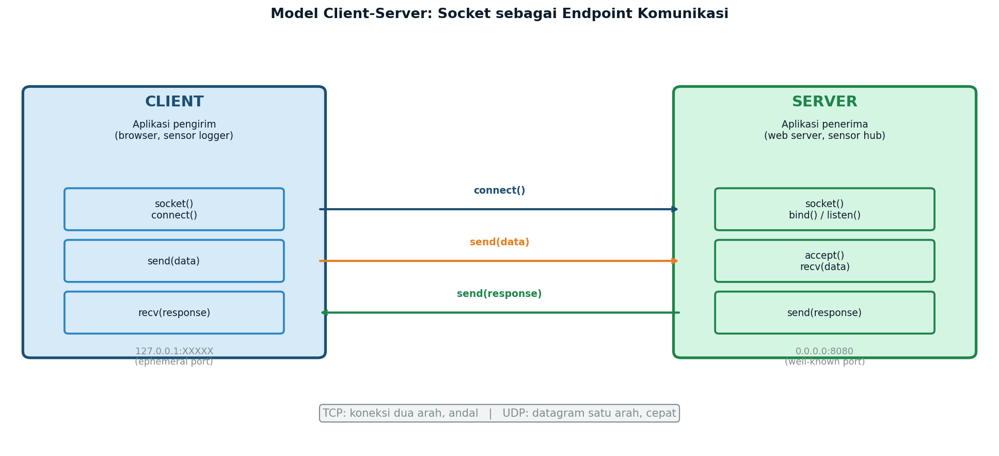
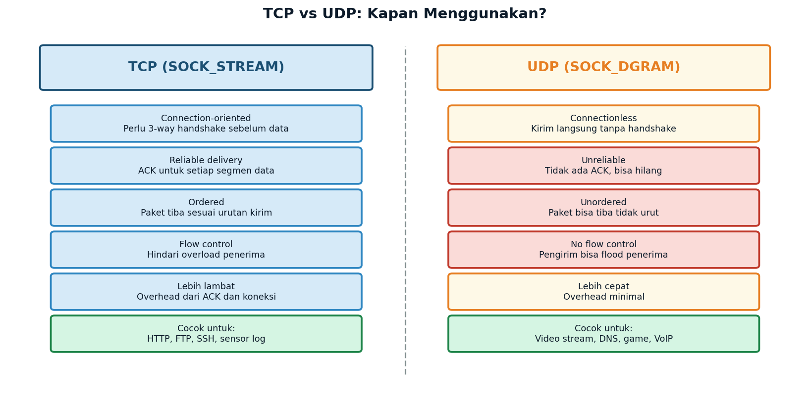
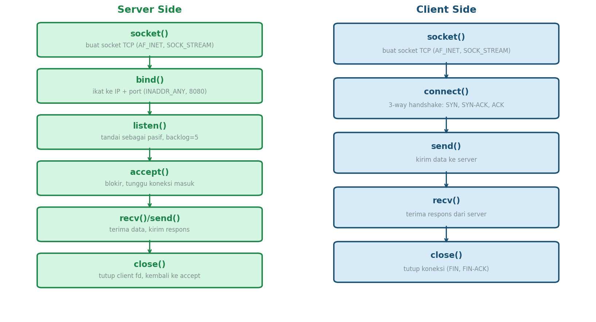
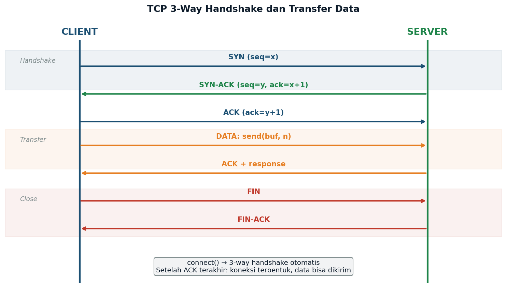
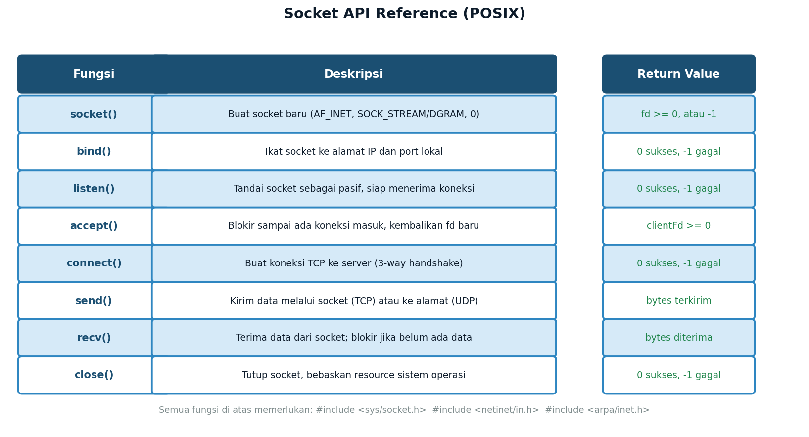

# Week 15 — Socket Programming & Network Communication
## *TCP, UDP, dan POSIX Socket API dalam C++*

**ENEE602004 · Algoritma Pemrograman dan Praktikum**
Dr. Alfan Presekal · Teknik Elektro · Universitas Indonesia

> **Penting:** Demo ini menggunakan POSIX socket API — hanya berjalan di Linux/WSL, bukan Windows native.

<div style="page-break-after: always;"></div>

---

# Topik yang Dibahas

- Konsep socket: endpoint komunikasi jaringan (IP:port)
- Model client-server: peran dan alur komunikasi
- TCP: connection-oriented, reliable, ordered
- UDP: connectionless, cepat, tanpa ACK
- POSIX Socket API: `socket`, `bind`, `listen`, `accept`, `connect`, `send`, `recv`
- TCP 3-way handshake (SYN, SYN-ACK, ACK)
- Aplikasi EE: sensor data server dengan protokol terstruktur

### File Demo

| File | Topik |
|------|-------|
| `src/01_tcp_server.cpp` | TCP echo server: socket, bind, listen, accept, recv/send |
| `src/02_tcp_client.cpp` | TCP client: socket, connect, send, recv |
| `src/03_udp_demo.cpp` | UDP demo: SOCK_DGRAM, sendto, recvfrom |
| `src/04_ee_sensor_server.cpp` | Aplikasi: sensor data server (protokol CH0:3.14V) |

<div style="page-break-after: always;"></div>

---

# Apa itu Socket?



**Socket** adalah endpoint komunikasi dua arah antara dua proses melalui jaringan. Setiap socket diidentifikasi oleh pasangan **(IP address : port number)**. Socket menjadi antarmuka antara program dan protokol jaringan (TCP/IP) yang dikelola oleh sistem operasi.

<div style="page-break-after: always;"></div>

---

# TCP vs UDP: Kapan Menggunakan?



**Pilih TCP** untuk: transfer file, login SSH, query database sensor, kontrol aktuator — di mana data tidak boleh hilang.

**Pilih UDP** untuk: streaming data ADC real-time, broadcast status sensor, protokol discovery jaringan — di mana kecepatan lebih penting dari keandalan.

<div style="page-break-after: always;"></div>

---

# TCP Server: Langkah-langkah



Server harus melewati 5 langkah sebelum bisa menerima data: `socket()` → `bind()` → `listen()` → `accept()` → `recv()/send()`. Client cukup: `socket()` → `connect()` → `send()/recv()`.

<div style="page-break-after: always;"></div>

---

# TCP Server — Kode

```cpp
// Langkah 1: Buat socket TCP (IPv4, connection-oriented)
int serverFd = socket(AF_INET, SOCK_STREAM, 0);

// Langkah 2: Bind ke IP + port
sockaddr_in addr{};
addr.sin_family      = AF_INET;
addr.sin_port        = htons(8080);  // konversi byte order
addr.sin_addr.s_addr = INADDR_ANY;   // semua interface
bind(serverFd, (sockaddr*)&addr, sizeof(addr));

// Langkah 3: Tandai pasif, backlog = 5 koneksi antre
listen(serverFd, 5);

// Langkah 4: Accept loop — blokir sampai ada client
while (true) {
    int clientFd = accept(serverFd, nullptr, nullptr);

    // Langkah 5: Terima data, kirim echo kembali
    char buf[1024];
    int n = recv(clientFd, buf, sizeof(buf)-1, 0);
    send(clientFd, buf, n, 0);  // echo
    close(clientFd);
}
```

<div style="page-break-after: always;"></div>

---

# TCP Client — Kode

```cpp
// Langkah 1: Buat socket TCP
int sock = socket(AF_INET, SOCK_STREAM, 0);

// Langkah 2: Isi alamat server
sockaddr_in server{};
server.sin_family = AF_INET;
server.sin_port   = htons(8080);
inet_pton(AF_INET, "127.0.0.1", &server.sin_addr);

// Langkah 3: Connect — 3-way handshake terjadi di sini
// SYN -> SYN-ACK -> ACK (otomatis oleh kernel)
connect(sock, (sockaddr*)&server, sizeof(server));

// Langkah 4: Kirim dan terima data
string msg = "Halo Server!\n";
send(sock, msg.c_str(), msg.size(), 0);

char buf[1024] = {};
int n = recv(sock, buf, sizeof(buf)-1, 0);
cout << "Echo: " << buf;

// Langkah 5: Tutup koneksi
close(sock);
```

<div style="page-break-after: always;"></div>

---

# TCP Handshake: Koneksi 3 Langkah



`connect()` secara otomatis memicu 3-way handshake. Setelah ACK terakhir diterima server, koneksi terbentuk dan data bisa mengalir. Penutupan koneksi juga terstruktur: FIN → FIN-ACK (dikirim oleh `close()`).

<div style="page-break-after: always;"></div>

---

# UDP: Connectionless

UDP tidak perlu `connect()`, `listen()`, atau `accept()`. Kirim langsung ke alamat tujuan dengan `sendto()`, terima dengan `recvfrom()`.

```cpp
// Buat UDP socket — SOCK_DGRAM bukan SOCK_STREAM
int sockFd = socket(AF_INET, SOCK_DGRAM, 0);

// Bind ke port lokal (untuk recvfrom)
sockaddr_in bindAddr{};
bindAddr.sin_family      = AF_INET;
bindAddr.sin_port        = htons(9090);
bindAddr.sin_addr.s_addr = INADDR_ANY;
bind(sockFd, (sockaddr*)&bindAddr, sizeof(bindAddr));

// sendto: kirim datagram langsung ke alamat tujuan
sockaddr_in dest{};
dest.sin_family = AF_INET;
dest.sin_port   = htons(9090);
inet_pton(AF_INET, "127.0.0.1", &dest.sin_addr);
const char* msg = "Sensor=3.14V";
sendto(sockFd, msg, strlen(msg), 0, (sockaddr*)&dest, sizeof(dest));

// recvfrom: terima datagram + catat alamat pengirim
char buf[1024]; sockaddr_in from{}; socklen_t flen = sizeof(from);
int n = recvfrom(sockFd, buf, sizeof(buf)-1, 0, (sockaddr*)&from, &flen);
close(sockFd);
```

<div style="page-break-after: always;"></div>

---

# Cara Kompilasi dan Cara Menjalankan

**PENTING:** Server harus dijalankan lebih dulu, baru client.

```bash
# Compile semua demo
make

# Demo 01 & 02: TCP server + client (dua terminal)
# Terminal 1:
./demo01              # TCP server menunggu di port 8080
# Terminal 2:
./demo02              # TCP client terhubung ke server
# Atau test server dengan netcat:
echo "halo" | nc localhost 8080

# Demo 03: UDP (satu terminal, self-contained)
./demo03              # kirim dan terima sendiri

# Demo 04: EE Sensor Server
# Terminal 1:
./demo04              # sensor server menunggu di port 8080
# Terminal 2 (test per channel):
echo "0" | nc localhost 8080   # -> CH0:3.14V
echo "3" | nc localhost 8080   # -> CH3:0.75V

# Bersihkan binary
make clean
```

<div style="page-break-after: always;"></div>

---

# Socket API Reference



Semua fungsi di atas berasal dari POSIX socket API. Header yang dibutuhkan:

```cpp
#include <sys/socket.h>   // socket, bind, listen, accept, connect, send, recv
#include <netinet/in.h>   // sockaddr_in, INADDR_ANY, htons
#include <arpa/inet.h>    // inet_pton, inet_ntop
#include <unistd.h>       // close
```

<div style="page-break-after: always;"></div>

---

# Aplikasi EE: Sensor Data Server

Server menerima ID channel (0–5), membalas dengan pembacaan sensor terstruktur. Pola ini mencerminkan sistem SCADA/IoT nyata.

```cpp
// Protokol: client kirim "0\n" -> server balas "CH0:3.14V\n"
// Data sensor simulasi (dalam sistem nyata: baca dari ADC/I2C)
static double readSensor(int channel) {
    double base[] = {3.14, 1.80, 2.50, 0.75, 5.00, 1.23};
    if (channel < 0 || channel >= 6) return -1.0;
    return base[channel];
}

// Di dalam accept loop:
int n = recv(clientFd, buf, sizeof(buf)-1, 0);
if (n > 0) {
    int ch = atoi(buf);             // parse channel ID
    double val = readSensor(ch);
    char resp[64];
    if (val < 0)
        snprintf(resp, sizeof(resp), "ERROR:invalid_channel\n");
    else
        snprintf(resp, sizeof(resp), "CH%d:%.2fV\n", ch, val);
    send(clientFd, resp, strlen(resp), 0);
}
// Test: echo "0" | nc localhost 8080  ->  CH0:3.14V
```

<div style="page-break-after: always;"></div>

---

# Latihan Mandiri

1. **Server Multi-pesan:** Modifikasi `01_tcp_server.cpp` agar setiap client bisa mengirim beberapa pesan (bukan hanya satu). Server terus menerima sampai client menutup koneksi. Uji dengan `nc localhost 8080` dan ketik beberapa baris.

2. **Echo Server dengan Prefix:** Modifikasi TCP server agar mengembalikan pesan dengan prefix timestamp: `[12:34:56] Halo\n`. Gunakan `ctime()` atau `chrono` untuk mendapatkan waktu.

3. **UDP Broadcast:** Buat program UDP yang mengirim pesan broadcast ke `255.255.255.255` (gunakan `SO_BROADCAST` socket option) dan program penerima yang mendengarkan di port yang sama. Jalankan keduanya di terminal terpisah.

4. **Sensor Multi-Channel:** Modifikasi `04_ee_sensor_server.cpp` agar client bisa mengirim format `"CH0,CH2,CH4\n"` (beberapa channel sekaligus) dan server membalas dengan semua nilai: `"CH0:3.14V CH2:2.50V CH4:5.00V\n"`. Gunakan `strtok()` atau `stringstream`.

5. **Koneksi Paralel:** Pelajari fungsi `fork()`. Modifikasi TCP server agar setiap koneksi masuk di-`fork()` ke proses baru, sehingga server dapat melayani banyak client secara bersamaan. Uji dengan membuka tiga terminal client sekaligus.

<div style="page-break-after: always;"></div>

---

# Referensi

- Stevens, W.R., Fenner, B., Rudoff, A.M. (2004). *Unix Network Programming, Vol. 1* (3rd ed.). Prentice Hall. Chapter 4: Elementary TCP Sockets.
- Beej's Guide to Network Programming: https://beej.us/guide/bgnet/ (sangat direkomendasikan untuk pemula)
- cppreference.com — POSIX socket: https://en.cppreference.com/w/cpp/header/sys/socket.h
- RFC 793 — Transmission Control Protocol (TCP): https://www.rfc-editor.org/rfc/rfc793
- RFC 768 — User Datagram Protocol (UDP): https://www.rfc-editor.org/rfc/rfc768
